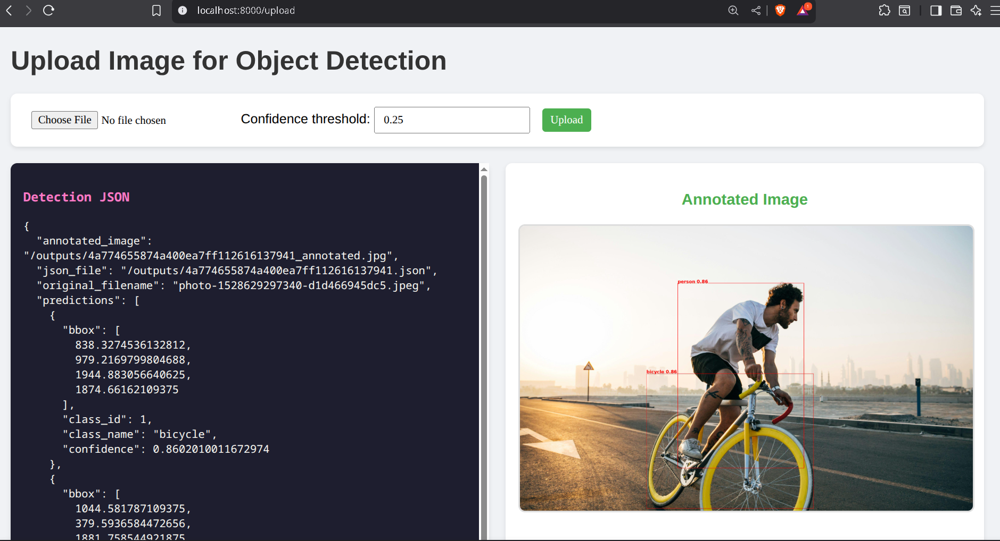

# YOLO Object Detection Microservice

This project implements a **microservice-based object detection system** using YOLOv3-Tiny. The system consists of two main services:

1. **AI Backend Service**: Performs object detection using YOLOv3-Tiny and returns JSON results and annotated images.
2. **UI Frontend Service**: Provides a simple interface for users to upload images and view detection results.

---

## Example Annotated Output



---

## Architecture Overview

* **AI Backend**:

  * Built using **FastAPI**
  * Performs object detection using **YOLOv3-Tiny**
  * Returns:

    * Annotated images with bounding boxes and readable labels
    * JSON files with detection results

* **UI Frontend**:

  * Connects to the AI backend via REST API
  * Allows image upload and displays detection results

---

## Prerequisites

* **Docker** and **Docker Compose** installed on your system.
* Fonts: `DejaVuSans-Bold.ttf` installed in the backend for readable labels (optinal).

---

---

## Build and Run

1. **Clone the repository**:

```bash
git clone https://github.com/SIDDHARTH000001/Technical-Assessment.git
cd Technical-Assessment
```

2. **Build and run all services**:

```bash
docker compose up --build
```

* **Frontend UI** will be accessible at: `http://localhost:8000`
* **AI Backend API** will be accessible at: `http://localhost:8001/docs`


---

## API Endpoints (AI Backend)

### POST `/detect`

* **Description**: Upload an image to detect objects.
* **Parameters**:

  * `file`: Image file (PNG, JPG, etc.)
  * `conf_threshold` (optional, default `0.25`)


**Response**:

* Annotated image: `/outputs/<uid>_annotated.jpg`
* JSON file: `/outputs/<uid>.json`

### GET `/outputs/{filename}`

* **Description**: Retrieve annotated images or JSON files by filename.

---

## References

1. YOLOv3-Tiny for object detection: [https://github.com/ultralytics/yolov3](https://github.com/ultralytics/yolov3)
2. DejaVu Fonts TTF: [https://github.com/senotrusov/dejavu-fonts-ttf](https://github.com/senotrusov/dejavu-fonts-ttf)
3. Fedora Font Docs: [https://docs.fedoraproject.org/en-US/quick-docs/fonts/](https://docs.fedoraproject.org/en-US/quick-docs/fonts/)
4. Docker Networking Docs: [https://docs.docker.com/engine/network/](https://docs.docker.com/engine/network/)

---
